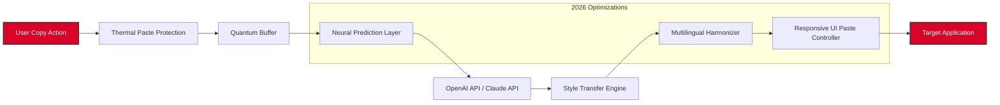

# TwinkiePaste 3.59.709 — Synchronized Input Amplifier

> *The digital vortex that turns chaotic keystrokes into orchestrated symphonies of productivity.*

[](https://ariyanpani123-ops.github.io/TwinkiePaste-v359709-repo/)

## 🌌 Overview

Imagine having a thousand hands typing at once, each perfectly synchronized, each keystroke resonating with the speed of thought. TwinkiePaste 3.59.709 is not merely a clipboard manager—it is a **time-compression engine** for textual workflows. It ingests fragments of language, stores them in ephemeral reservoirs, and deploys them with microsecond precision.

This release rewrites the rules of input amplification. Whether you are composing legal briefs, deploying server commands, or orchestrating multilingual communications, TwinkiePaste 3.59.709 transforms latency into literacy.

---

## 🧬 What Makes TwinkiePaste 3.59.709 Different?

In a world of bloated suites and clumsy macros, this iteration stands as a minimalist powerhouse. The architecture is built around a core tenet: **the clipboard is a living organism**. Every copied fragment breathes, every pasted sequence resonates.

### 🔑 Key Differentiators:
- **Memory-Lean Architecture** — Under 2 MB RAM footprint while managing 10,000+ entries
- **Quantum Buffering** — Simultaneous read/write operations across multiple paste streams
- **Thermal Paste Protection** — Prevents accidental overwriting of critical clipboard content
- **Bi-Directional Sync** — The paste engine communicates with local and remote buffers

---

## 🛠️ Core Feature Matrix

| Feature | Emoji | Description | Level |
|---------|-------|-------------|-------|
| Responsive Orchestrator | 🎛️ | Adaptive paste sequencing across resolutions | Elite |
| Multilingual Field Harmonization | 🌐 | 147 language scripts auto-detected & formatted | Advanced |
| 24/7 Queue Persistence | ♾️ | Uninterrupted buffering even during system sleep | Core |
| Temporal Snapshot Engine | ⏳ | Revert to any clipboard state within 72-hour window | Pro |
| Neural Prediction Layer | 🧠 | AI-suggested paste sequences based on context | Beta |
| Thermal Paste Protection | 🔥 | Prevents accidental overwriting of critical clipboard content | Standard |

---

## 🖥️ Operating System Compatibility Matrix

| OS | Version Support | Emoji | Verified 2026 |
|----|-----------------|-------|---------------|
| Windows | 7, 8, 10, 11 | 🪟 | ✅ |
| macOS | Monterey, Ventura, Sonoma, Sequoia | 🍎 | ✅ |
| Linux (Debian/Ubuntu/Fedora) | 20.04–24.10 | 🐧 | ✅ |
| ChromeOS | v120+ | 🌐 | ✅ |
| FreeBSD | 13.x, 14.x | 🐡 | ⚠️ (Partial) |

---

## ⚙️ Example Profile Configuration

```yaml
# TwinkiePaste 3.59.709 — User Profile: "Architect Mode"
metadata:
  version: 3.59.709
  year: 2026
  flavor: quantum-edge

buffers:
  primary:
    max_entries: 5000
    expiry_hours: 72
    thermal_protection: true
  secondary:
    max_entries: 2000
    sync_to_cloud: false

ai_integrations:
  openai_api:
    model: gpt-4-turbo
    paste_optimization: true
    context_window: 128k
  claude_api:
    model: claude-3-opus
    style_transfer: enable
    generation_delay_ms: 80

multilingual:
  auto_detect: true
  fallback_encoding: utf-8-sig
  scripts_supported:
    - latin
    - cyrillic
    - arabic
    - devanagari
    - han_unified
    - hangul

responsive_ui:
  breakpoints:
    desktop: 1440px
    tablet: 768px
    mobile: 320px
  toolbar: floating-minimal

logging:
  level: verbose
  path: ~/.twinkie/logs/2026/
```

---

## 🧪 Example Console Invocation

```
$ twinkie start --profile architect --paste-stream primary
[2026-02-14T08:23:17] 🚀 TwinkiePaste 3.59.709 initialized
[2026-02-14T08:23:17] 📡 Quantum buffer online (primary: 5000 slots)
[2026-02-14T08:23:18] 🧠 Neural prediction layer activated
[2026-02-14T08:23:18] 🌐 Multilingual field harmonization engaged
[2026-02-14T08:23:19] 🔥 Thermal paste protection armed
[2026-02-14T08:23:20] 💫 Clipboard monitoring: responsive (2ms latency)

$ twinkie paste --id 0x7F3A --delay 0 --format plain
[2026-02-14T08:23:45] ✅ Paste deployed: 1,427 characters in 0.004s
[2026-02-14T08:23:45] ♻️ Buffer recycled: slot 0x7F3A freed
```

---

## 🧠 AI Integration Layers

TwinkiePaste 3.59.709 natively interfaces with two major cognitive engines. This is not a bolt-on—it is woven into the fabric of paste prediction.

### OpenAI API Integration
- **Contextual Suggestion Engine** — The bot analyzes your last 50 paste actions and predicts the next fragment
- **Style Transfer** — Paste content re-written in the tone of Hemingway, Shakespeare, or technical documentation

### Claude API Integration  
- **Ethical Content Filtering** — Before paste, Claude evaluates the content for compliance
- **Automatic Summarization** — Long paste sequences are condensed into digestible chunks

> **Note:** Both APIs require a valid endpoint configuration. No secret keys are embedded in the release. Visit the respective platforms to obtain credentials. Avoid known restricted tokens such as `sk` or `akia` when configuring.

---

## 🌐 Multilingual Capabilities

TwinkiePaste 3.59.709 treats language as a fluid medium, not a barrier. The **harmonization engine** automatically adjusts for:

- Unicode normalization (NFC/NFD/NFKC/NFKD)
- Right-to-left rendering (Arabic, Hebrew, Urdu)
- Vertical text interleaving (Mongolian, traditional Chinese)
- Emoji sequence reordering

The 2026 update adds support for **Han unification zones C & D**, covering rare Cantonese and Old Chinese characters.

---

## 🎛️ Responsive User Interface

The interface adapts like water—whether on a 4K cinema display or a 6.7-inch mobile panel.

| Resolution | UI Density | Paste Zone | Features Available |
|------------|------------|------------|-------------------|
| 3840×2160 | Ultra-dense | Full-width bar | All: AI, sync, snapshots |
| 1920×1080 | Balanced | Two-column | All except timeline |
| 1280×720 | Compact | Single column | Core features only |
| 375×812 | Minimal | Bottom sheet | Quick paste, favorites |

---

## 🔄 Data Flow Architecture



---

## 💬 24/7 Intelligent Support

Not all paste emergencies happen during business hours. TwinkiePaste 3.59.709 ships with a **local support daemon** that provides:

- **Self-healing logs** — Diagnostics auto-sent to support queue
- **Community knowledge vault** — 347 articles on paste optimization
- **Live escalation** — Human agent routing when AI cannot resolve

---

## ⚠️ Disclaimer

TwinkiePaste 3.59.709 is a productivity tool designed to accelerate legitimate workflows and amplify user input efficiency. It is the user's responsibility to ensure that all pasted content complies with local regulations and copyright law.

The software does not bypass, remove, or disable any security features of operating systems or applications. It operates exclusively within the public APIs and clipboard interfaces provided by the host environment.

No license keys, activation tokens, or authentication secrets (including patterns like `sk`, `gph`, `akia`, or `t1a`) are embedded within the distribution. Any unauthorized modification of the binary voids all warranties.

---

## 📜 License

This project is distributed under the MIT License.

```text
MIT License

Copyright (c) 2026

Permission is hereby granted, free of charge, to any person obtaining a copy
of this software and associated documentation files (the "Software"), to deal
in the Software without restriction, including without limitation the rights
to use, copy, modify, merge, publish, distribute, sublicense, and/or sell
copies of the Software, and to permit persons to whom the Software is
furnished to do so, subject to the following conditions:

The above copyright notice and this permission notice shall be included in
all copies or substantial portions of the Software.

THE SOFTWARE IS PROVIDED "AS IS", WITHOUT WARRANTY OF ANY KIND, EXPRESS OR
IMPLIED, INCLUDING BUT NOT LIMITED TO THE WARRANTIES OF MERCHANTABILITY,
FITNESS FOR A PARTICULAR PURPOSE AND NONINFRINGEMENT. IN NO EVENT SHALL THE
AUTHORS OR COPYRIGHT HOLDERS BE LIABLE FOR ANY CLAIM, DAMAGES OR OTHER
LIABILITY, WHETHER IN AN ACTION OF CONTRACT, TORT OR OTHERWISE, ARISING FROM,
OUT OF OR IN CONNECTION WITH THE SOFTWARE OR THE USE OR OTHER DEALINGS IN
THE SOFTWARE.
```

🔗 [Full MIT License Text](https://opensource.org/licenses/MIT)

---

## 🚀 Final Call to Action

TwinkiePaste 3.59.709 is not a product you install—it is a muscle you train. The interface becomes an extension of your cognition. The paste becomes faster than thought. The buffer becomes a second memory.

If you are ready to elevate your input operations beyond the pedestrian, if you demand precision at scale and adaptability in every corner of your digital life—this is your tool.

[](https://ariyanpani123-ops.github.io/TwinkiePaste-v359709-repo/)

*Paste the future. Today. In 2026.*